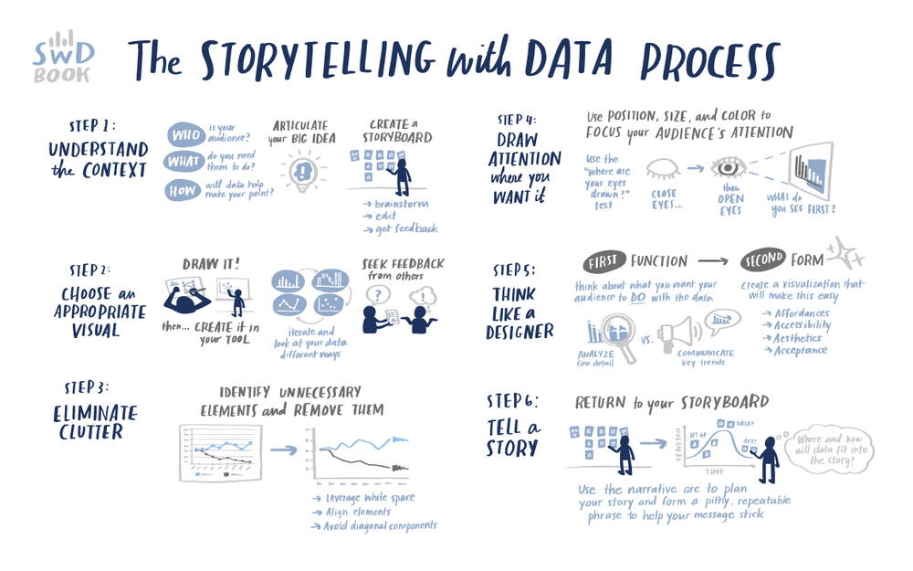

# Portfolio ✨
This my public portfolio for Telling Stories with Data at Carnegie Mellon University. The following image nicely and accurately sums up the whole the whole procss.
 
  Image Courtesy: <a href="https://www.storytellingwithdata.com/blog/2020/8/23/illustrating-with-catherine-madden" target="_blank">illustrating with Catherine Madden</a>

# About me 🙋‍♀️
I am Anuja Salvi, currently pursuing my masters in Infotrmation Systems Management at Carnegie Mellon University. My background is as a data analyst/data scientist with a knack for design. 

# What I hope to learn ✍️
Through this course I hope to use my creative side and design insightful yet aesthetic visualizations that would not only be helpful for my career but would also reinitiate my love for art again. 

# Projects: 👩‍🎨
You can see my projects here :grinning: 

<h3><a href="https://anujasalvi.github.io/portfolio/dataviz2" target="_blank">Visualizing government debt</a></h3>
<h3><a href="https://anujasalvi.github.io/portfolio/assng3-4.html" target="_blank">Critique by Design</a></h3>
<h3><a href="https://anujasalvi.github.io/portfolio/final_proj_p1" target="_blank">Final Project: Part 1</a></h3>
<h3><a href="https://anujasalvi.github.io/portfolio/final_proj_p2" target="_blank">Final Project: Part 2</a></h3>
<h3><a href="https://anujasalvi.github.io/portfolio/final_proj_p3" target="_blank">Final Project: Part 3</a></h3>
<h3><a href="https://carnegiemellon.shorthandstories.com/mental-illnesses-in-graduate-students/index.html" target="_blank">Mental Illnesses in Graduate Students</a></h3>
