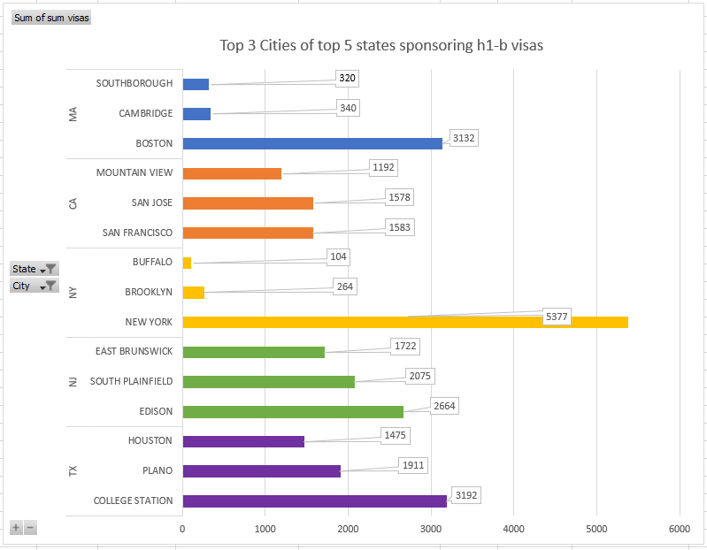

# Assignment 3 & 4: Critique by Design

<h2 style="display:inline-block"> Part 1: Original Visualization</h2>

 
  
This circle-packing diagram groups and counts a tabular dataset of <a href="https://www.uscis.gov/tools/reports-and-studies/h-1b-employer-data-hub?state=All&fy=4&naics=All&items_per_page=10&page=1" target="_blank" rel="noopener noreferrer">H‑1B employers from 2019 provided on USCIS.</a>

  
  
When I first looked at this visualization my initial thought was "What is this? And my eyes hurt" This might be the best example of "TOO much data" in a visualization. There are too many circles which makes it difficult to read any labels that exist in the graph. What the circles represent is also unknown due to a lack of title. And how the size of each circle is determined is also unknown. But being a member of the audience that would benefit the most with the H-1B Employer Data, I thought I need to refine this graph into something more suitable and legible for the audience while also trying to deliver valuable insights that would be expected by them when they see a visualization on this subject.

<h2 style="display:inline-block"> Part 2: The Process</h2>

 
  <u><h3 style="display:inline-block">Data:</h3></u>
  
  
The visualization I chose to critique utitlized the <a href="https://www.uscis.gov/tools/reports-and-studies/h-1b-employer-data-hub?state=All&fy=4&naics=All&items_per_page=10&page=1" target="_blank" rel="noopener noreferrer">H1-B Employer Hub Data 2019</a> from the official U.S. Citizenship and Immigration Services (<a href="https://www.uscis.gov/">USCIS</a>) site. Hence, making it even more important to be visualized effectively so as to deliver impactful insights.

  
  <u><h3 style="display:inline-block">Critique:</h3></u>
  
  
As summarized above, it is not at all lucid what this graph wants to convey. Any person would have to spend a good 5 minutes to understand this visual (I know I did). And if any visualization requires more than a minute to understand what it wants to convey, there's not much use of the visual now is there? The lack of title, lack of legend, lack of colors, lack of the number of visas, lack of any information that would help me as an audience member to decode the goal of this graph makes me want to do a better job at graphing and displaying such important data to the core audience (which are majorly going to be students). 
    So when it comes to <b><i>Usefulness</i></b> and <b><i>Perceptibility</i></b>, the graph can be scord really less. While considering the <b><i>Completeness</i></b> of this visual, it might be <i>too</i> complete. The information is right, but the amount is not. Additionally,  context that’s needed to understand the information has not been provided either. <b><i>Truthfulness</i></b> of this visual is high, the data is accurate annd valid and every circle is accurately scaled. For obvious reasons, <b><i>Intuitiveness</i></b> and <b><i>Aesthetics</i></b> is ranked the lowest. <b><i>Engagement</i></b> is somewhere between "Distracts from data" and "Neutral". The graph does try to draw attention to the data, but the concentric circles also does tend to distract you. 
    Above all this, if any person having trypophobia was supposed to be a part of the audience, they would have a panic attack in a second of seeing this graph.
  
 
 
  <u><h3 style="display:inline-block">Sketching Solution:</h3></u>
  
  

    <u><h4 style="display:inline-block">Sketch 1:</h4></u> 
    My first sketch was to incorporate this data in a a more visually pleasing way. Hence, I chose a Treemap to show the same data, but it gives the user the control over how much they want to go in detail. It starts with the same broad subject, states, and then can be drilled down further to cities and then to the companies in those cities and get the number of visas as a popup for every step when hovered over it.
    
    

  
  Even though this graph is a little less messier, my initial critique of too much data still exists along with the lack of clarity in the message to convey through this.
  
    <u><h4 style="display:inline-block">Sketch 2:</h4></u> 
    For my second draft I thought to visualize some more detailed data that I would like to see as a user. I decided to graph a couple of bar charts. 
  <b>First: A bar chart that shows Top 3 cities of Top 5 states of highest H1-B sponsoring companies.</b>
   
  This bar chart is color grouped by state to show relevance between the graphs. It is simpler to understand as compared to the treemap and gives a overview of the important information an audience maybe interested in. 
  <b>Second: A bar chart that shows Top 10 highest H1-B sponsoring companies</b>
  

  This bar chart shows the Top 10 companies that sponsor H1-B visas in the whole of U.S. This looks better than the previous graph and gives a good idea of the companies one should focus on.
  
  <u><h4 style="display:inline-block">Sketch 3:</h4></u> 
  <b>Second: A  Word Cloud that shows Top 100 cities</b>
  For this sketch, I decided to focus on the  cities that had the highest H-1B sponsoring companies.
  

  This graph grabs the attention of the users to the various cities consisting of such companies. This is especially useful if the user wants to know which city location they would like to move to.
  

  
  <u><h3 style="display:inline-block">Testing:</h3></u>
  

  For testing and acquiring feedback for my sketches, I asked 2 people the exact same questions and recorded them using a voice recorder with their permission. Following is the tabulated transcript of their respective responses :
  <table>
  <tr>
    <th>Questions</th>
    <th>Student, Early 20s</th>
    <th>Adult, Late 20s</th>
  </tr>
  <tr>
    <td>What do you think the first graph is about?</td>
    <td>I don't know, It looks like some <i>mandala</i>.</td>
    <td>It is a circle packing graph, although not sure what is it about.</td>
  </tr>
  <tr>
    <td>Is the sketch 1 clearer than the original visual? Is there anything else that you would like to see in this graph?</td>
    <td>Oh, this is definitly better. This is the data of H-1B visas in U.S. Although, it is still congested and hard to read. You could reduce boxes.</td>
    <td>Hmm, it certainly looks better, but the quantity is still an issue here. If the city names are only going to be shown for some states, you would rather focus on those cities and states only.</td>
  </tr>
  <tr>
    <td>Any opinons on the bar graphs in Sketch 2? Are these conveying a strong enough goal to the audience?</td>
    <td>The bar 2 looks better than bar 1. It has only one color as compared to bar 1 and also targets the audience who are interested in knowing only the top companies. </td>
    <td>What is your goal? If it is the top companies, then yes. The bar 1 gives a rainbow effect and a legend is missing too. The bar 2 looks neat lthough the number of visas are missing.</td>
  </tr>
  <tr>
    <td>Look at Sketch 3, what does it tell you?</td>
    <td>100 cities. Although I won't be able to tell you where most of them are located in the U.S. </td>
    <td>The Top 100 cities. The word cloud is a nice way to emphasize some of the important cities, but not 100. There are too many words in this visual, and also too many colors.</td>
  </tr>
  <tr>
    <td>As an audience member, what insights would you like to get most importantly?</td>
    <td>Umm, states and number of visas would be nice to know. As an international student I would focus on States as a whole, I don't know all the cities here.</td>
    <td>All these insights were good and I would like to see any insight that you want to clearly convey. But you might want to consider using fewer colors in your final graph while keeping it minamilistic and clean. </td>
  </tr>
</table>

  
  

