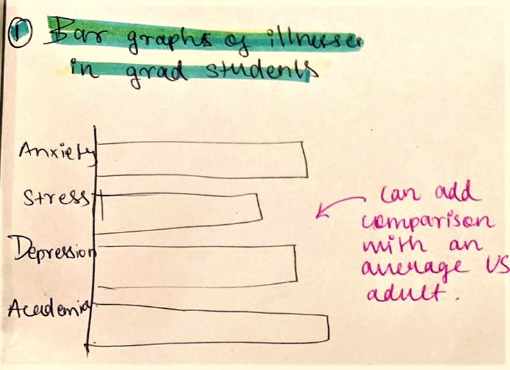
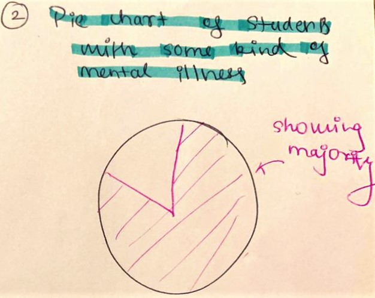
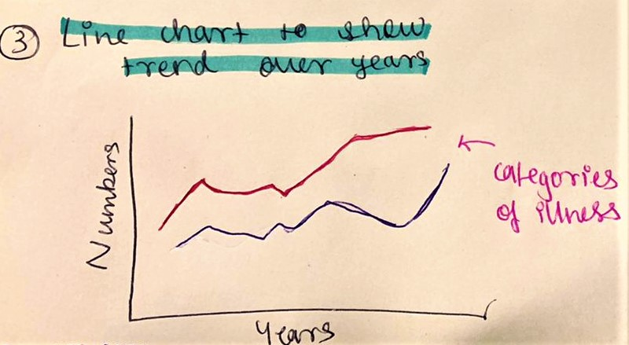
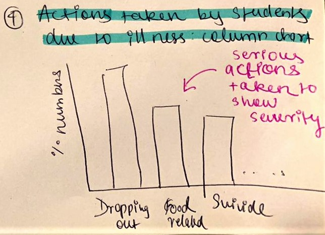

# Final Project: Part 1

<h2 style="display:inline-block">Outline</h2>

 
  
 
    As my final project I am deciding to choose a topic really personal to me and something that I am really passionate about to spread more awareness about it. Hence, I am choosing to tell the story of <b><i>Mental Illnesses in Graduate Students</i></b>. For this topic I am going to outline the following points:
    <ul>
  <li>Understanding the prevalence and severity of mental health issues</li>
  <li>Understanding what students are thinking, feeling, and experiencing</li>
  <li>Making recommendations on steps students and programs can take to improve student mental health</li>
</ul>
  

<h2 style="display:inline-block">Initial Sketches</h2>

 
  
 
    <ul>
      <li><b><u>Sketch 1:</u></b>
       
        <b>Bar Graph of mental illnesses in Graduate Students.</b> 
        In this graph I wanted to show the numbers depicting different illnesses in students. These numbers can also be in percentages. Additionally, we can also make it a grouped chart to see comparisons between average U.S. adult and students to know the severity of tis issue. 
        
      </li>
      
      <li><b></u>Sketch 2:</u></b>
       
        <b>Pie Chart showing how many students have mental illnesses.</b> 
        This graph shows the proportion of students compared to all the students that suffer from any kind of mental illnesses. 
        
      </li>

      <li><b></u>Sketch 3:</u></b>
       
        <b>Line chart showing trend</b> 
        This visual focuses on showcasing the trends of these diseases over the years in students. This aims to highlight the increase of illnesses in students.  
        
      </li>
      
      <li><b></u>Sketch 4:</u></b>
       
        <b>Column chart depicting actions taken by students due to mental illnesses</b> 
        Showing actions will highlight the sverity of the situation. 
        
      </li>
</ul>
  

