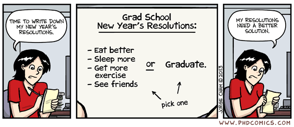
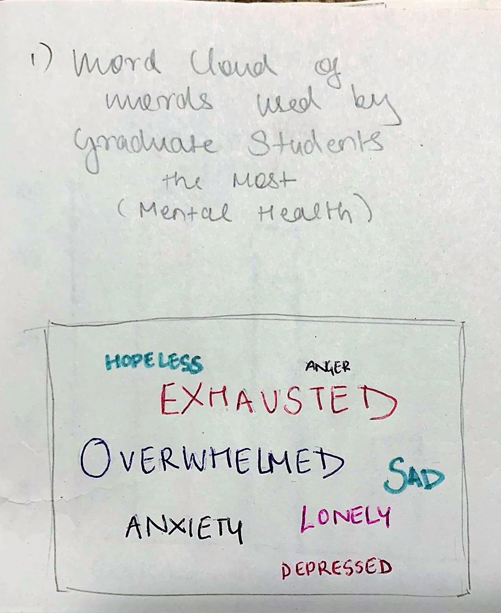
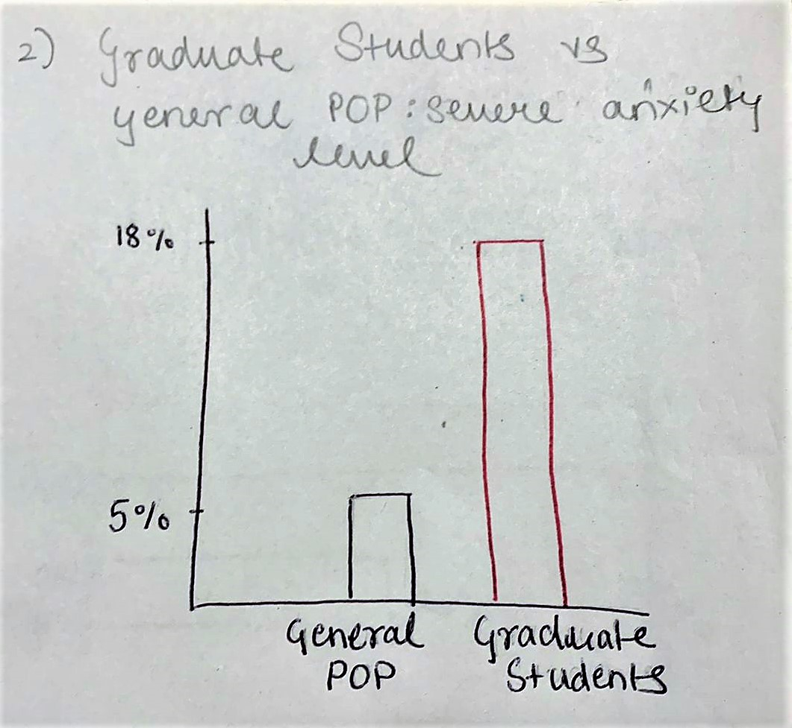
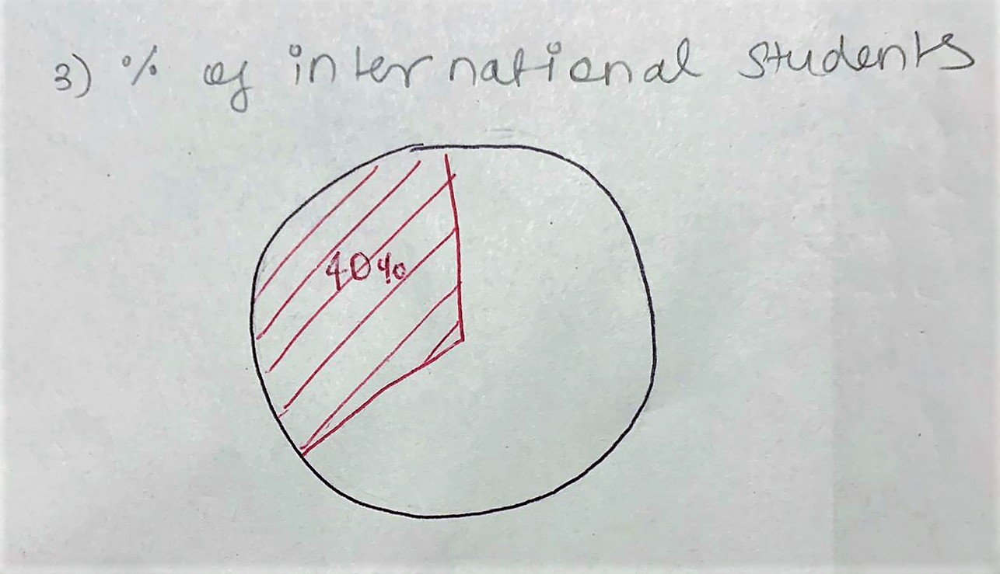
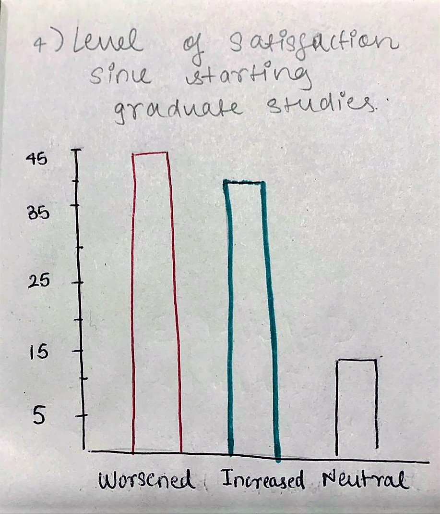
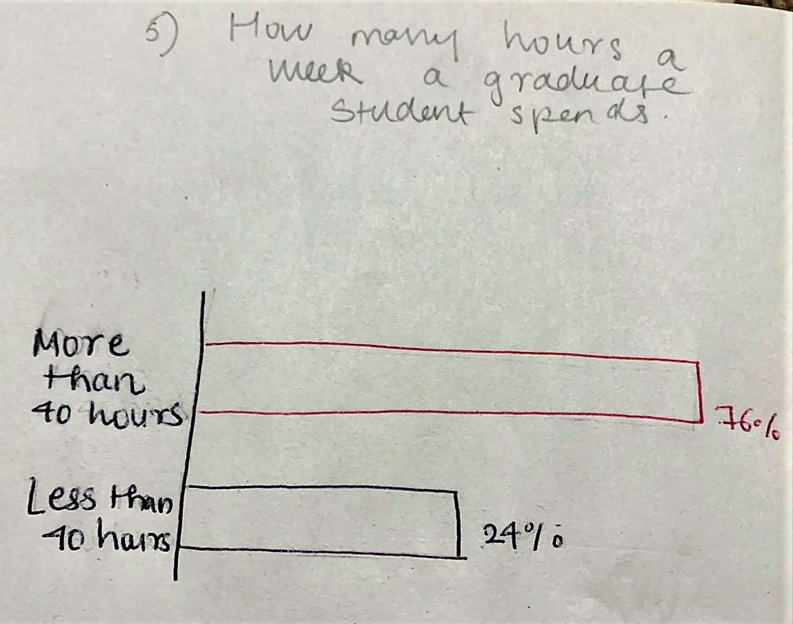

# Final Project: Part 2

Extending on part 1 of the final project. The outline and data are the same as part 1.

<h2 style="display:inline-block">Outline</h2>

 
  
 
    As my final project I am deciding to choose a topic really personal to me and something that I am really passionate to spread more awareness about it. Hence, I am choosing to tell the story of <b><i>Mental Illnesses in Graduate Students</i></b>. For this topic I am going to covver and expand further on the following points:
    <ul>
  <li>Understanding the prevalence and severity of mental health issues</li>
  <li>Understanding what students are thinking, feeling, and experiencing</li>
   <li>Understanding dfferent demographics of students with mental illnesses</li>
  <li>Making recommendations on steps programs can take to improve student mental health</li>
  
</ul> 
   
  Image Courtesy: <a href="https://phdcomics.com/comics.php?f=1670" target="_blank">PhD Comics</a>
  

<h2 style="display:inline-block">Data</h2>

 
  
 
    The data I wanted to use to effectively present this story was mostly survey and evidence based. Hence, most of them come from papers about already conducted surveys and research on mental well being and illnesses in graduate students. The survey results in these papers show an in depth analysis done on the students' mental well being while also mentioning the various demographics and background of the students that took the survey. The research papers that I would be referring too can be found <a href="https://github.com/anujasalvi/portfolio/tree/main/final%20project%20dataset" target="_blank">here</a>. These papers are from credible sources such as <a href="/final project dataset/2021-CCMH-Annual-Report.pdf" target="_blank">Center for Collegiate Mental Health, Penn State Uni</a>, <a href="/final project dataset/CICMH-Graduate-Student-Mental-Health_Toolkit.pdf" target="_blank">Centre for Innovation in Campus Mental Health (CICMH), Canada</a>, <a href="/final project dataset/bbb_mentalhealth_paper.pdf" target="_blank">Harvard University</a> and <a href="/final project dataset/NCHA-III_FALL_2021_REFERENCE_GROUP_EXECUTIVE_SUMMARY.pdf" target="_blank">American College Health Association</a> to name a few.   
    Additonally, facts and suggestions from articles like <a href="https://www.gograd.org/resources/grad-student-mental-health/" target="_blank">Mental Health in Grad School</a>, <a href="https://adaa.org/finding-help/helping-others/college-students/facts" target="_blank">Mental Health and College Students</a> and <a href="https://www.huffpost.com/entry/the-college-mental-health-crisis-focus-on-general_b_58bd93bce4b0ec3d5a6ba0ea" target="_blank">The College Mental Health Crisis</a> will also be used in my project. 
    I aim to create visuals with this data that would help the audience easily understand the severity of the situation and observe the trends that have been alarmingly increasing over the years. Also hoping to educate about mental illnesses in students like us and emphasisng the importance of being aware because this is something that is very common. Furthermore, I hope to provide some suggestions to the students as well as the programs.
  

<h2 style="display:inline-block">Wireframe</h2>

 
  
The visuals:  
    <b><i>Intoducing the audience:</i></b> 
    <ul>
      <li><b><u>Visual 1:</u></b>
       
        <b>Word Cloud of words used the most by graduate students</b> 
        In this visual I wanted to show the most common words used by Graduate Students on a day-to day basis, hence showing how they are feeling everyday. 
        
      </li>
       
      <b><i>Will further dive into the story by showing comparisons</i></b>  
      <li><b><u>Visual 2:</u></b>
       
        <b>Column chart of severe stress levels in general population vs graduate students</b> 
        In this visual I wanted to show "how graduate students are different?" to the general population when it comes to stress and anxiety. Hence this column chart visualizes this vast difference between the two. 
        
      </li>
       
      
       <b><i>Bringing demographics into picture</i></b>  
      <li><b><u>Visual 3:</u></b>
       
        <b>Pie chart depicting students demographics</b> 
        This visual focuses on showcasing the percentage of students that are not Americans and are international. This visual aims to show that there is a vast diversity in the pool of graduate students. 
        
      </li>
       
      
       <b><i>What students are feeling</i></b>  
      <li><b><u>Visual 4:</u></b>
       
        <b>Column chart depicting how students feel since starting graduate studies</b>.  
        This visual shows how many students feel that their level of satisfaction have actually worsened since the start of their graduate studies. This number is a little bit more than the percent of students who feel that their level of satisfaction has increased. This shows the amount of stress students go through. 
        
      </li>
      
      <li><b><u>Visual 5:</u></b> 
       
        <b>Bar chart of students' work hours</b>.  
        This visual aims to highlight the percent of graduate students <that have more than 40 hours per week schedule. Hence showing graduate students are not only stressed but overworked. 
        
      </li> 
</ul>
  

<h2 style="display:inline-block">User Reseach</h2>

 
  
Since my topic is about mental illnesses in graduate students, my target audience are the same and I hope to convey this story to them convincingly. 
  I aim to choose students with different demographics(age, ethnicity, gender, etc.) as individuals to interview to get a more diverse pool of replies and feedback.
  <table>
    <tr>
    <th>Questions</th>
    <th>Student, Male, Early 20s</th>
    <th>Student, Female, Late 20s</th>
    <th>Student, Female, Mid 20s</th>
  </tr>
  <tr>
    <td>What do you think the first graph is about?</td>
    <td>--</td>
    <td>--</td>
    <td>--</td>
  </tr>
  <tr>
    <td>Is this a compelling story?</td>
   <td>--</td>
   <td>--</td>
   <td>--</td>
  </tr>
  <tr>
    <td>Do you want to see anytthing else?</td>
    <td>--</td>
    <td>--</td>
    <td>--</td>
  </tr>
  <tr>
    <td>Are thses visualizations making a powerful impact about the topic?</td>
    <td>--</td>
    <td>--</td>
    <td>--</td>
  </tr>
  <tr>
    <td>As the core tarhet audience and the test subject, what insights would you like to get most importantly?</td>
    <td>--</td>
    <td>--</td>
    <td>--</td>
  </tr>
</table>
  

